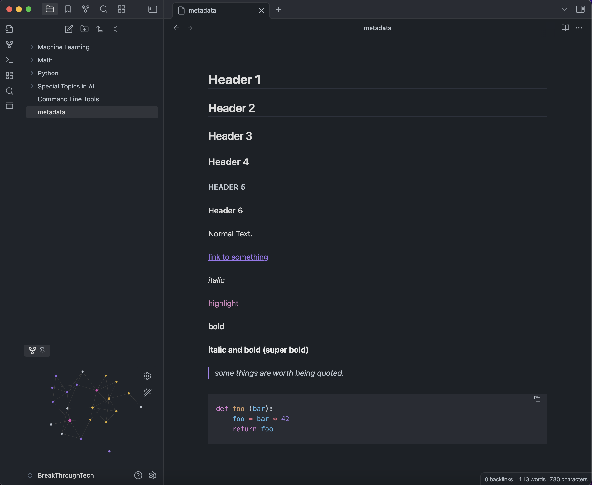

# Minimal Things

### Notes on V1 and V2 of this theme

This theme is a fork
of [Things Theme](https://github.com/colineckert/obsidian-things) by [Colin Eckert](https://github.com/colineckert).



## Features

- Things-inspired color palette while staying true to minimal default obsidian
- Headers are easier to differentiate from text
- Images are always centered
- Improved highlighted text
- Light and dark theme
- Quick preview/edit floating action button on mobile
- Customizable colors for bold, italic, highlighters, and block-quotes via the
  [Style Settings](https://github.com/mgmeyers/obsidian-style-settings)
  community plugin
- Modified Atom code syntax highlighting
- Enhanced code blocks with line numbers
- Tag pills for readability
- Checkbox styling and icons
- Better designed image cards
- [JetBrains Mono](https://www.jetbrains.com/lp/mono/) font and ligatures for
  code

## Supported Plugins

This theme has support for the following Obsidian community plugins (Things V1):

- [Sliding Panes (Andy's Mode)](https://github.com/deathau/sliding-panes-obsidian)
- [Calendar](https://github.com/liamcain/obsidian-calendar-plugin)
- [Kanban](https://github.com/mgmeyers/obsidian-kanban)
- [Hider](https://github.com/kepano/obsidian-hider)
- [Checklist](https://github.com/delashum/obsidian-checklist-plugin)
- [Todoist](https://github.com/jamiebrynes7/obsidian-todoist-plugin)
- [Style Settings](https://github.com/mgmeyers/obsidian-style-settings)
- [Advanced Mobile Toolbar](https://github.com/phibr0/obsidian-advanced-toolbar)

## Checkbox Styling

Things supports a wide number of alternate checkbox types. These allow you to
call out tasks that are incomplete, canceled, rescheduled, etc. See below for
availale checkbox types.


```
## Basic
- [ ] to-do
- [/] incomplete
- [x] done
- [-] canceled
- [>] forwarded
- [<] scheduling

## Extras
- [?] question
- [!] important
- [*] star
- ["] quote
- [l] location
- [b] bookmark
- [i] information
- [S] savings
- [I] idea
- [p] pros
- [c] cons
- [f] fire
- [k] key
- [w] win
- [u] up
- [d] down
- [D] draft pull request
- [P] open pull request
- [M] merged pull request
```

## Installation (Manual Only)

1. Download this repo
2. Copy the `theme.css` file into your vault's `/.obsidian/themes` directory
3. Rename the file to `Minimal Things.css` so it will have a unique name in the
   theme selection dropdown
4. Open the **Settings** in Obsidian
5. Navigate to **Appearances** tab under **Options**
6. Under the **Themes** section, click on the dropdown menu next to **Theme**
   heading
7. Select `Mininal Things` and then you're done! 🎉

## Feedback

If you have any issues and/or suggestions, please submit an issue or raise a PR.
I will try my best to answer as quickly as possible!

## Credits

This theme is a fork
of [Things Theme](https://github.com/colineckert/obsidian-things) by [Colin Eckert](https://github.com/colineckert).
According to **Colin Eckert** Things theme is based on **@kepano** work and
inspired by **@chetachiezikeuzor**.
